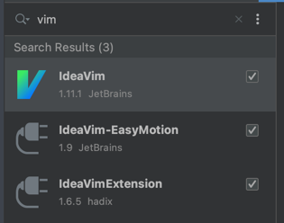

### 项目使用

#### 创建.ideavimrc的软连接
```shell
ln -s 项目/.ideavimrc ~/.ideavimrc

cd /Users/mac/Library/Application Support/JetBrains/WebStorm2023.1/keymaps
ln -s ~/ideavim/macOS_jayce.xml .
```

#### idea安装插件


恭喜你，已经可以快速使用ideavim了, 具体的配置文档上有。
vim详细的操作文档，可以参考博客:
link: https://chaozwn.github.io/2022/12/26/vim%E5%91%BD%E4%BB%A4%E6%98%8E%E7%BB%86/

#### 安装marabiner
1. put those json config files into '$HOME/.config/karabiner/assets/complex_modifications'
2. open karabiner element, goto complex modifications tab, click add rule then add rules we set.

```shell
把几个json文件复制到~/.config/karabiner/assets/complex_modifications
```